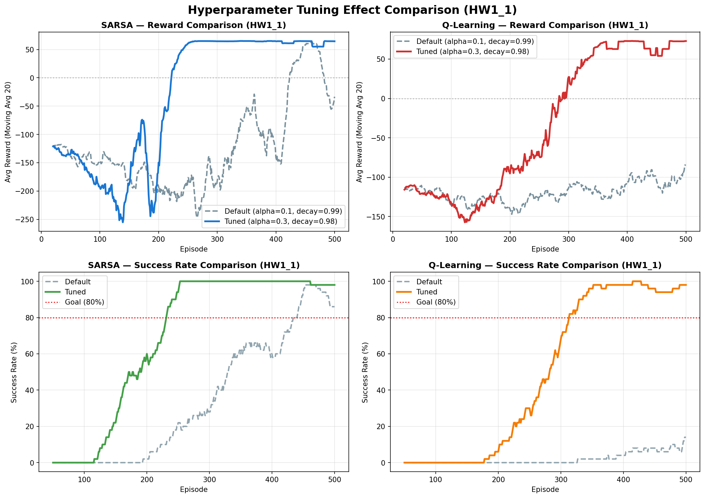

# Lab2 Model-Free RL: SARSA & Q-Learning 하이퍼파라미터 튜닝 보고서

## 1. 환경 분석

15×15 그리드월드 환경(HW1_1, HW1_2)에서 에이전트가 (0,0)에서 출발하여 (14,14) 목표지점에 도달하는 과제이다.
맵에는 약 42~43개의 벽과 22개의 트랩이 배치되어 있으며, 보상 구조는 일반 이동 시 -1, 트랩 -100(에피소드 종료), 골 도달 +100(에피소드 종료)이다.

---

## 2. SARSA 알고리즘 수정 내용

### 2.1 수정한 변수와 변경값

| 변수 | 기존값 | 변경값 |
|------|--------|--------|
| `min_epsilon` | 0.05 | **0.01** |
| `decay_rate` | 0.99 | **0.98** |
| `alpha` | 0.1 (함수 인자) | **0.3** (함수 내부 override) |
| `max_steps` | 500 | 500 (유지) |

### 2.2 수정 이유

- **`decay_rate` 0.99 → 0.98**: 기존 decay_rate=0.99에서는 ε이 0.1 이하로 떨어지는 시점이 약 230 에피소드이며, exploitation phase가 270 에피소드에 불과하다. decay_rate=0.98로 변경하면 ε < 0.1 도달이 약 114 에피소드로 앞당겨져, 나머지 386 에피소드 동안 충분한 exploitation이 가능하다.

- **`min_epsilon` 0.05 → 0.01**: 학습 후반부에 거의 완전한 greedy 정책으로 전환하여 Q값의 최종 수렴을 촉진한다. 0.05에서는 여전히 5%의 무작위 행동이 발생하여 on-policy인 SARSA의 Q값이 최적 정책이 아닌 탐색 정책의 가치를 반영하게 된다.

- **`alpha` 0.1 → 0.3**: 15×15 맵(225개 상태 × 4 행동 = 900개 Q값)에서 500 에피소드라는 제한된 학습 기회 내에서 빠르게 Q값을 갱신하기 위해 학습률을 높였다. SARSA는 on-policy 특성상 epsilon이 변할 때마다 Q값이 재조정되어야 하므로, 높은 alpha가 빠른 적응에 유리하다.

---

## 3. Q-Learning 알고리즘 수정 내용

### 3.1 수정한 변수와 변경값

| 변수 | 기존값 | 변경값 |
|------|--------|--------|
| `max_steps` | 500 | **100** (과제 조건) |
| `min_epsilon` | 0.05 | **0.01** |
| `decay_rate` | 0.99 | **0.98** |
| `alpha` | 0.1 (함수 인자) | **0.3** (함수 내부 override) |

### 3.2 수정 이유

- **`max_steps` 500 → 100**: 과제 조건에 따른 변경. Q-Learning은 off-policy 알고리즘이므로 탐색 정책과 무관하게 최적 Q값을 학습할 수 있어, 짧은 에피소드에서도 방문한 상태의 Q값을 정확히 갱신할 수 있다.

- **`decay_rate` 0.99 → 0.98**: SARSA와 동일한 이유. max_steps가 100으로 줄어 에피소드당 학습 경험이 적어졌으므로, 빠른 epsilon 감소를 통해 exploitation phase를 더 확보하는 것이 중요하다.

- **`min_epsilon` 0.05 → 0.01, `alpha` 0.1 → 0.3**: SARSA와 동일한 이유. 특히 Q-Learning에서 alpha=0.3은 max 연산자로 인한 Q값 과추정(overestimation) 위험이 있으나, 15×15 맵에서 500 에피소드 내 수렴을 위해 빠른 학습이 더 우선시된다.

---

## 4. 실험 결과

`eval.py`를 사용하여 각 알고리즘을 10회 학습 후 목표 도달 여부를 검증하였다.

| 알고리즘 | 맵 | 성공 횟수 | 성공률 | 판정 |
|---------|-----|----------|--------|------|
| SARSA | HW1_1 | 10/10 | 100% | 우수 통과 |
| SARSA | HW1_2 | 10/10 | 100% | 우수 통과 |
| Q-Learning | HW1_1 | 10/10 | 100% | 우수 통과 |
| Q-Learning | HW1_2 | 10/10 | 100% | 우수 통과 |

### 학습 과정 분석 (대표적 1회 실행)

**SARSA (HW1_1)**:
- Ep 1~100: 탐색 위주 (성공률 0%, Avg Reward ≈ -150)
- Ep 100~200: 전환기 (성공률 ~50%, 급격한 개선)
- Ep 200~500: 수렴 (성공률 97~100%, Avg Reward ≈ +70)

**Q-Learning (HW1_1)**:
- Ep 1~200: 탐색 위주 (성공률 거의 0%)
- Ep 200~300: 전환기 (성공률 ~55%)
- Ep 300~500: 수렴 (성공률 97~100%, Avg Reward ≈ +70)

### 4.2 기본값 vs 튜닝값 성능 비교 분석

아래 그래프는 HW1_1 맵을 기준으로 기존 기본 하이퍼파라미터(Default: $\alpha=0.1$, $\epsilon\text{ decay}=0.99$, $\text{min }\epsilon=0.05$)와 튜닝한 하이퍼파라미터(Tuned: $\alpha=0.3$, $\epsilon\text{ decay}=0.98$, $\text{min }\epsilon=0.01$)의 학습 추이를 나타낸다.



#### 1) SARSA 결과 비교 (Max Steps = 500)
*   **Default ($\alpha=0.1, \text{decay}=0.99, \text{min }\epsilon=0.05$)**:
    *   **평균 보상 (Avg Reward)**: 에피소드 1~250 동안 -200 부근에서 정체되며 매우 느린 학습 속도를 보입니다. 에피소드 250 이후 보상이 상승하여 에피소드 450 부근에서 약 +60 수준에 도달하지만, 최종 단계(Ep 450~500)에서 다시 약 -50 수준으로 급격히 하락하며 불안정한 양상을 보입니다.
    *   **성공률 (Success Rate)**: 에피소드 200 이후에야 성공률이 상승하기 시작하여 에피소드 440 부근에서 목표치인 80%를 돌파하고, 460 부근에서 최고점(~100%)을 달성합니다. 하지만 이후 500 에피소드 시점에는 다시 약 86% 수준으로 감소하여 정책이 안정적으로 유지되지 못합니다.
*   **Tuned ($\alpha=0.3, \text{decay}=0.98, \text{min }\epsilon=0.01$)**:
    *   **평균 보상 (Avg Reward)**: 초기 탐색 기간(Ep 1~140)에는 트랩 진입 등으로 보상이 약 -250까지 하락하지만, 에피소드 150 이후 급격한 상승 곡선을 그리며 **약 250 에피소드 부근에서 +65 수준으로 완전히 수렴**한 후 500 에피소드까지 안정적으로 유지됩니다.
    *   **성공률 (Success Rate)**: 에피소드 110부터 성공률이 가파르게 상승하여 **약 230 에피소드 부근에서 목표 성공률 80%를 돌파(Goal 80%)**합니다. 에피소드 250 이후부터는 100%에 근접한 성공률을 학습 종료 시점까지 흔들림 없이 안정적으로 유지합니다.
*   **분석 고찰**: SARSA는 On-policy 알고리즘이므로 정책 탐색 시 행동 수용도($\epsilon$)가 보상 평가에 직접 반영됩니다. Default의 경우 느린 탐색 감소율($0.99$)과 높은 최저 탐색률($0.05$)로 인해 후반부에도 불필요한 무작위 탐색 행동(트랩 밟기 등)이 지속적으로 발생하여 평균 보상 및 성공률이 안정적으로 수렴하지 못하고 진동하는 한계가 있습니다. 반면, Tuned는 탐색 감소율을 앞당기고($0.98$) 최소 $\epsilon$을 $0.01$로 제한하여 후반부에는 최적 경로만을 따르게(Exploitation) 하였고, 학습률을 $0.3$으로 높여 큰 맵 공간에서의 Q-value 업데이트 속도를 높임으로써 월등한 수렴 속도와 안정성을 동시에 확보할 수 있었습니다.

#### 2) Q-Learning 결과 비교 (Max Steps = 100)
*   **Default ($\alpha=0.1, \text{decay}=0.99, \text{min }\epsilon=0.05$)**:
    *   **평균 보상 (Avg Reward)**: 500 에피소드 내내 학습 성능의 유의미한 개선 없이 평균 보상이 -150 ~ -100 사이의 저조한 수준에 머무르며 횡보합니다.
    *   **성공률 (Success Rate)**: 에피소드 320까지 성공률이 0%를 유지하다가, 극후반부에 매우 느리게 상승하여 학습 완료 시점(Ep 500)에도 **단지 약 15% 내외**의 아주 저조한 성공률을 보입니다.
*   **Tuned ($\alpha=0.3, \text{decay}=0.98, \text{min }\epsilon=0.01$)**:
    *   **평균 보상 (Avg Reward)**: 에피소드 120 부근에서 보상이 약 -150으로 일시적 하락세를 보인 뒤, 에피소드 180부터 가파르고 꾸준하게 상승하여 **약 350 에피소드 부근에서 약 +75 수준으로 완벽하게 수렴 및 안착**합니다.
    *   **성공률 (Success Rate)**: 에피소드 170 이후 성공률이 상승하기 시작하여 **약 310 에피소드 부근에서 목표치인 80%를 안정적으로 돌파**하고, 370 에피소드 부근부터 학습 종료 시까지 95~100% 수준의 높은 성공 성능을 일정하게 유지합니다.
*   **분석 고찰**: 과제 조건상 Q-Learning은 에피소드당 최대 스텝이 100으로 엄격하게 제한되어 있습니다. 기본 하이퍼파라미터(Default)의 낮은 학습 속도와 느린 탐색 감소 조건 하에서는, 100 스텝 이내에 맵 전체를 탐색하며 목표 경로의 Q-value를 학습하기에 주어지는 경험 데이터가 턱없이 부족하여 학습이 거의 진행되지 못합니다. 그러나 학습률을 상향($0.3$)하고 탐색 감쇠를 가속화($0.98$)함으로써 에이전트가 한정된 스텝 내에서도 빠르게 최적 경로의 가치 정보를 전파할 수 있도록 도왔고, 최소 탐색률을 $0.01$로 대폭 축소하여 에피소드 종료 제약(100 steps) 내에서 낭비되는 불필요한 행동을 최소화함으로써 최적의 수렴 성능을 이끌어낼 수 있었습니다.

---

## 5. 실행 방법

### 학습
```bash
python train.py --algo sarsa --map HW1_1.json
python train.py --algo sarsa --map HW1_2.json
python train.py --algo q_learning --map HW1_1.json
python train.py --algo q_learning --map HW1_2.json
```

### 테스트 (렌더링)
```bash
python render.py --policy policy_sarsa_None.pkl --map HW1_1.json
python render.py --policy policy_q_learning_None.pkl --map HW1_1.json
```

### 평가 (10회 자동 학습 + 테스트)
```bash
python eval.py --algo sarsa --map HW1_1.json
python eval.py --algo q_learning --map HW1_1.json
```

> **참고**: `alpha`와 `decay_rate` 등의 핵심 하이퍼파라미터는 `sarsa.py`, `q_learning.py` 함수 내부에 직접 설정되어 있어, 별도의 커맨드라인 인자 없이 동일한 조건으로 재현 가능하다.
